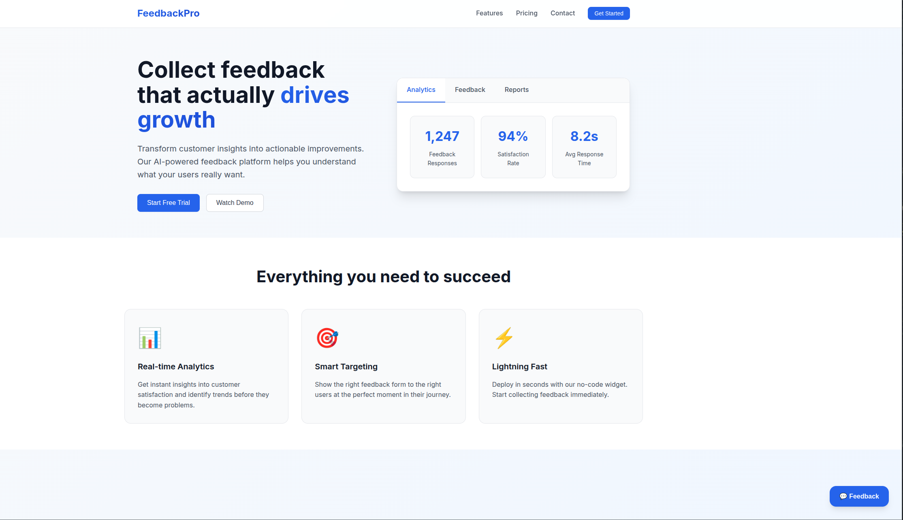

## Project Description

A React feedback component that displays feedback in a dedicated Slack Channel.

## Design Preview

### Application

### Feedback Form

## Plugin Used

Slack App

## Setting It Up

- Install Nodejs and React.
- Create a Slack App. See [Instructions](https://blog.openreplay.com/integrate-react-with-slack/).
- Download the Zip file or clone the repository.
- Open .env file, Set the value of "VITE_HOOK" to the Slack App webhook URL.
- CD into the project directory.
- Run npm install.
- Import the feedback component into your application.
